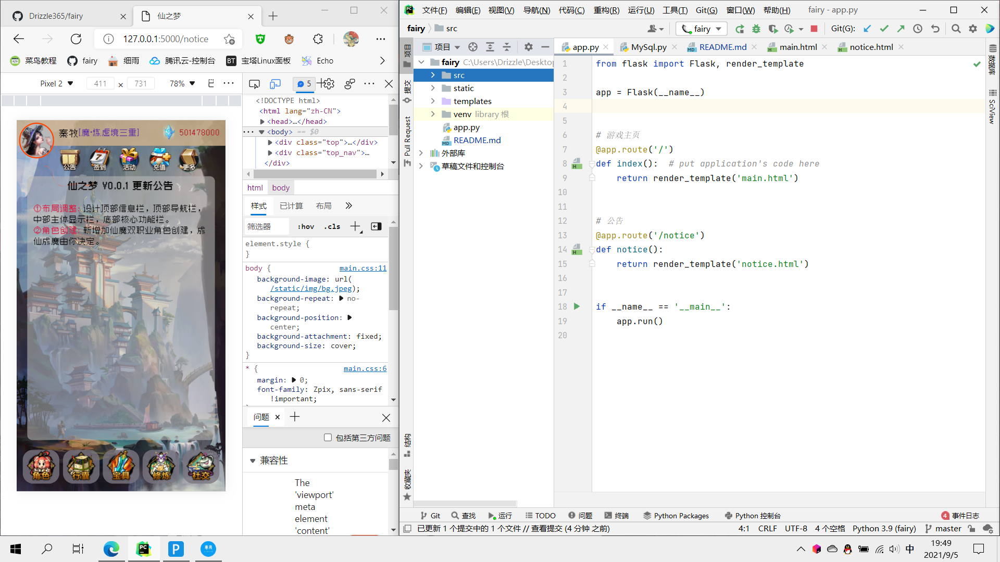

# 仙之梦

> 一个由 `Python-Flask` 框架创作的文字修仙类网页游戏。

## 起源
基于十年前2G网页文字游戏的灵感和想要去做一个真正符合修仙世界的游戏的热情  
于是这个项目诞生了~

## 计划
### 1.开发
开发功能阶段，这将会是本项目历时最长的一个阶段。
### 2.封装
当第一版游戏开发完成后会进行Docker容器的封装，将本游戏推送到官方仓库，方便更多人去一键部署。

